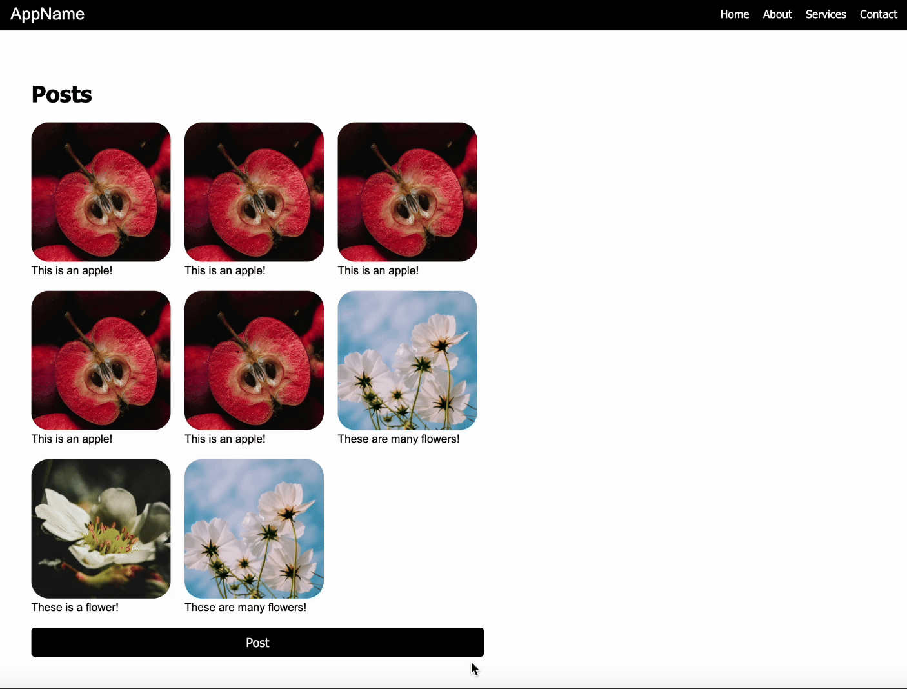

# 6.1040 HTML + CSS Recitation Prep

## Getting Started

Run `npm install` to install dependencies.

## Running Locally

Run `npm start` and navigate to [http://127.0.0.1:8080](http://127.0.0.1:8080) to view the page.

## Complete TODOs 1, 2, 3, & 4

TODOs 1 and 2 are in `index.html` and TODOs 3 and 4 are in `styles.css`.

You should not need to modify any other code.

The TODOs will require you to have knowledge of flexbox, CSS selectors, and basic HTML elements such as `
`, ``, and `
`.

Your final page should look something like this with the addition that when you hover over the Post button, the button changes color:

